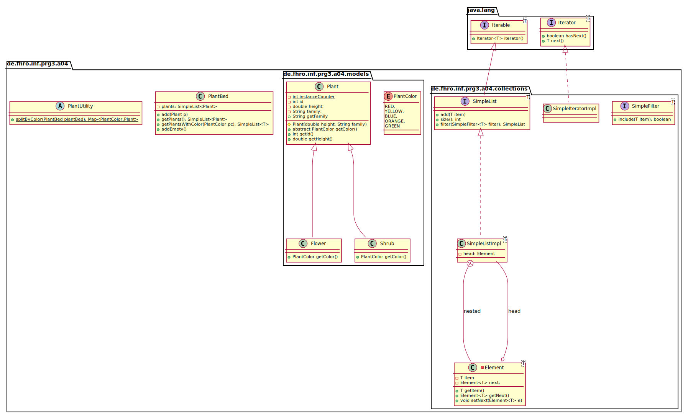

_This is an assignment to the class [Programmieren 3](https://hsro-inf-prg3.github.io) at the [University of Applied Sciences Rosenheim](http://www.fh-rosenheim.de)._

# Assignment 4: Generics

In this assignment we want to improve the already implemented `SimpleListImpl` of assignment 2.
When we implemented `SimpleListImpl` for the first time we didn't know anything about generics so we had to save our items as `Object`s.
Now that we are aware of this great feature we're able to keep the type information and to avoid type casts!

Given is the solution of assignment 2 and the `abstract` model class `Plant`.

## Setup

1. Create a fork of this repository (button in the right upper corner)
2. Clone the project (you're getting the link by clicking the green _Clone or download button_)
3. Import the project to your IDE (remember the guide in assignment 1)
4. Validate your environment by running the tests from your IntelliJ and by running `gradle test` on the command line.

## Part 1

The first part of the assignment is mostly about replacing `Object` by the ominous `T`. When you've completed part 1 you should have an idea why generics are necessary for implementing reusable code.

1. Generify the interfaces and classes
    * `SimpleList`
    * `SimpleFilter`
    * `SimpleListImpl`
    * `SimpleIteratorImpl`
    * `Element`
2. Adopt the changes in the test class `SimpleListTests.java`
3. Check which type casts aren't required anymore
4. Add the new method `addEmpty()` in the `SimpleList` interface 
    _Hint:_ this method aims on the instantiation problem of generics

## Part 2

In the second part we want to use our own generic list by implementing a flower bed which keeps track of all plants in it. Additionally we want to implement a short utility method which shows you how to use generics in `static` contexts.

1. Implement the two child classes:
    * `Flower` 
        A flower may have any color except green - you've to validate this in the constructor!
    * `Shrub` 
        A shrub is always green - think of it when you implement the `abstract` method `getColor()`!
2. Implement the class `PlantBed`. Have a look at the given UML to get an idea what this class is for.
3. Implement the `static` utility method `splitByColor(...)` in an `abstract` utility class `PlantUtility` (can you imagine why this class should be `abstract` and optimally has a `private` constructor?)