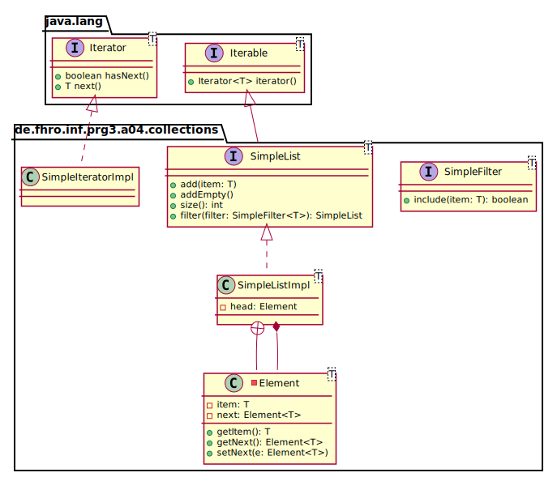
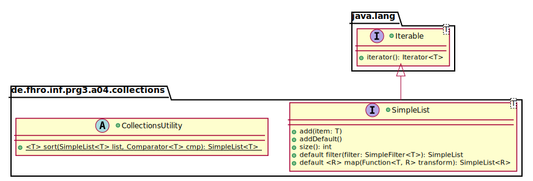

_This is an assignment to the class [Programmieren 3](https://hsro-inf-prg3.github.io) at the [University of Applied Sciences Rosenheim](http://www.th-rosenheim.de)._

# Assignment 4: Generics


In this assignment we want to improve the previously implemented `SimpleListImpl` of [Assignment 2](https://github.com/hsro-inf-prg3/02-classes-interfaces).
Back then, `SimpleListImpl` was implemented to store references of type `Object`, which in turn required a type cast on retrieval:

```java
SimpleList sl = new SimpleListImpl();
sl.add(new MyClass());
MyClass k = (MyClass) sl.get(0);

```

Inside `SimpleListImpl`, the knowledge about the actual class was lost, and worse: the following code would compile but produce a runtime exception:

```java
SimpleList sl = new SimpleListImpl();
sl.add(new MyClass());
sl.add(new MyOtherClass());
MyClass k1 = (MyClass) sl.get(0);  // all ok
MyClass k2 = (MyOtherClass) sl.get(1);  // ClassCastException!
```

Generics help us to avoid both the type cast and the risk of runtime exceptions by checking the type at compile time.

For this assignment, start with the reference solution of assignment 2 and the `abstract` model class `Plant`.


## Setup

1. Create a fork of this repository (button in the right upper corner)
2. Clone the project (get the link by clicking the green _Clone or download button_)
3. Import the project to your IDE (remember the guide in assignment 1)
4. Validate your environment by running the tests from your IntelliJ and by running `gradle test` on the command line.


## Generic Lists



To make a class generic, introduce a generic type (typically named `T`) in the class or interface signature, and replace all affected actual types with the generic type.

1. Make the following interfaces and classes generic
    * `SimpleList`
    * `SimpleFilter`
    * `SimpleListImpl`
    * `SimpleIteratorImpl`
    * `Element`
2. Adopt the changes in the test class `SimpleListTests.java`
3. Remove the now unnecessary type casts
4. Add a new method `addDefault` to the `SimpleList` interface; the purpose is to add a default instance (using the default constructor) to the list<br>
    _Hint:_ this method aims at the instantiation problem of generics.


## Generic Methods



In the second part we want to focus on generic and `default` methods.
For this purpose we'll add an additional method `map(...)` and move the method `filter(...)` to the interface `SimpleList`.

1. Implement the `filter(...)` method as `default` method in the `SimpleList` interface <br>(remember to run the tests when you completed the refactoring to ensure that the result is still the same)
2. Add the `map(...)` method to the `SimpleList` interface according to the given UML (`default` method)<br>The `map(...)` method transforms every element of your list with the given `Function<T,R>` to another element of type `R` and collects all elements in a new `SimpleList`.
3. _Optionally:_ Implement the the `sort(...)` method as `static` utility method in the `abstract` class `CollectionsUtility`.
    <br> _You may choose any sort algorithm: Bubblesort, Mergesort,...depending on your choice you may need to add some methods to `SimpleList` and `SimpleListImpl`_
    <br>(can you imagine why this class should be `abstract` and optimally has a `private` constructor?)

**Remember, an untested implementation is worthless! Expand the given test suite to ensure that your algorithms are correct.**